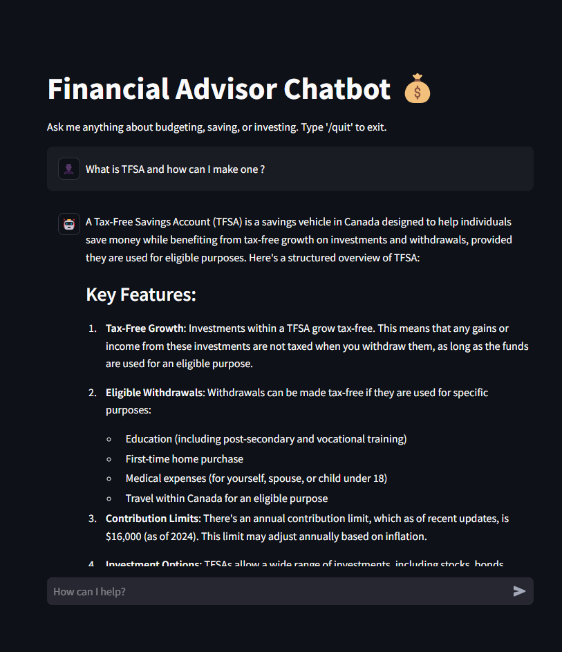

# Financial Advisor Chatbot 💰

This is a **Financial Advisor Chatbot** built with Streamlit, Ollama, and Langchain, designed to help users with financial-related questions, including budgeting, saving, and investing. The chatbot offers personalized, concise, and number-driven advice.

<div style="display: flex; justify-content: space-around;">
  
  
</div>

## Features:
- **Financial Advice**: Ask the bot anything about budgeting, investing, savings, loans, mortgages, retirement, and more.
- **Query Validation**: The bot ensures responses are financial-related and politely declines any off-topic questions.
- **Humor Integration**: The bot responds with light-hearted humor for non-financial inquiries to keep the conversation engaging.
- **Chat History**: Keeps track of your conversation history, which is stored locally.

## Tech Stack:
- **Streamlit**: Used for building the interactive user interface.
- **Ollama**: A model serving platform used for generating the chatbot’s responses.
- **Langchain**: Integrated for prompt management and enhancing chatbot behavior.
- **Regular Expressions (Regex)**: For query validation and filtering responses.

## Installation:
Follow these steps to run the chatbot locally:

### 1. Clone the repository:
```bash
git clone https://github.com/sudhanshrestha/ChatFinancial.git
cd ChatFinancial
```

### 2. Set up a virtual environment:
It's recommended to use a virtual environment for the project.
```bash
python -m venv venv
source venv/bin/activate  # For Windows use: venv\Scripts\activate
```

### 3. Install dependencies:
Run the following command to install the required Python libraries:
```bash
python requirements.txt
```
### 4. Run the `ollama.bat` file:
Double-click on the `run_ollama.bat` file to execute the command `ollama run deepseek-r1:8b` in the Command Prompt.

**Note:** You can change the model to any other available model. To do this, visit the [Ollama website](https://ollama.com/search) to find the model you want to use. Then, update the model name in the `current_model` variable in the `chat.py` file to match the new model.


### 5. Run the app:
**Note:** You will need to have `ollama` program running before doing this step, ensure its running on the background.
After installing the dependencies, you can start the Streamlit app with:
```bash
streamlit run app.py  # or whatever your main file is named
```

Visit [http://localhost:8501](http://localhost:8501) in your browser to interact with the chatbot.

## Features & Usage:

### Query Validation:
The chatbot only responds to queries related to finances. For example, questions like:
- "How can I save money for retirement?"
- "What are some good budgeting strategies?"

If you ask a question unrelated to finances, the chatbot will politely decline, using humor to keep the interaction engaging.

### Chat History:
The chat history is stored locally, and you can review the entire conversation. You can also delete your chat history at any time by clicking the "Delete Chat History" button in the sidebar.

### Customization:
You can modify the chatbot’s behavior by adjusting the prompt template in the `app.py` file. You can also tweak the list of financial keywords used for query validation.

## Deployment:
The app is hosted on **Streamlit Community Cloud**. If you wish to host the chatbot yourself, follow these steps to deploy it on platforms like **Heroku** or **Streamlit Community Cloud**.

## Contributing:
Contributions are welcome! Feel free to open issues or submit pull requests to enhance the functionality of this chatbot.

---

## License:
This project is open-source under the MIT License.

---

MIT License

Copyright (c) 2025 Sudhan Shrestha

Permission is hereby granted, free of charge, to any person obtaining a copy of this software and associated documentation files (the "Software"), to deal in the Software without restriction, including without limitation the rights to use, copy, modify, merge, publish, distribute, sublicense, and/or sell copies of the Software, and to permit persons to whom the Software is furnished to do so, subject to the following conditions:

The above copyright notice and this permission notice shall be included in all copies or substantial portions of the Software.

THE SOFTWARE IS PROVIDED "AS IS", WITHOUT WARRANTY OF ANY KIND, EXPRESS OR IMPLIED, INCLUDING BUT NOT LIMITED TO THE WARRANTIES OF MERCHANTABILITY, FITNESS FOR A PARTICULAR PURPOSE AND NONINFRINGEMENT. IN NO EVENT SHALL THE AUTHORS OR COPYRIGHT HOLDERS BE LIABLE FOR ANY CLAIM, DAMAGES OR OTHER LIABILITY, WHETHER IN AN ACTION OF CONTRACT, TORT OR OTHERWISE, ARISING FROM, OUT OF OR IN CONNECTION WITH THE SOFTWARE OR THE USE OR OTHER DEALINGS IN THE SOFTWARE.

---
